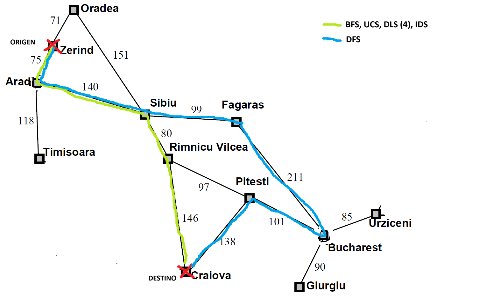

# Ejercicio 1 - Búsqueda no informada

## Pareja elegida

* **Origen**: Zerind
* **Destino**: Craiova

| Algoritmo | Path | Depth | Cost (km) | Expanded (nodes) | Generated (nodes) | Status |
| :--- | :--- | :---: | :---: | :---: | :---: |:---: |
| **BFS** | Zerind → Arad → Sibiu → Rimnicu Vilcea → Craiova | 4 | 441 | 7 | 17 | success | 
| **UCS** | Zerind → Arad → Sibiu → Rimnicu Vilcea → Craiova | 4 | 441 | 10 | 26 | success |
| **DFS** | Zerind → Arad → Sibiu → Fagaras → Bucharest → Pitesti → Craiova | 6 | 764 |7|20|sucess|
| **DLS** (limit 2) | NA | NA | NA |3|8|cutoff|
| **DLS** (limit 4) | Zerind → Arad → Sibiu → Rimnicu Vilcea → Craiova| 4 | 441 |6|12|sucess|
| **IDS** | Zerind → Arad → Sibiu → Rimnicu Vilcea → Craiova| 4 | 441 |16|42|sucess|