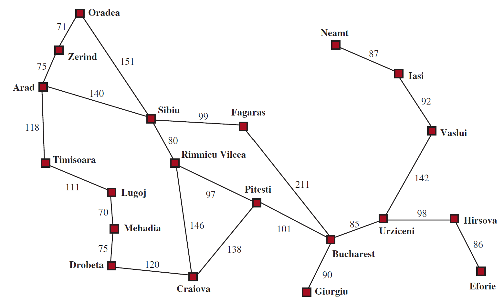
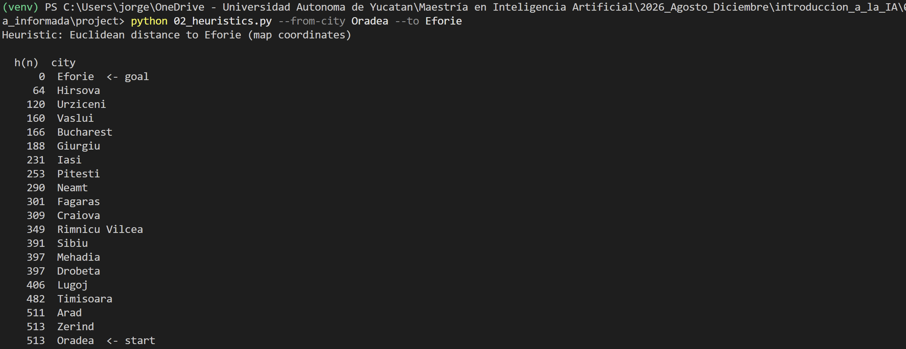
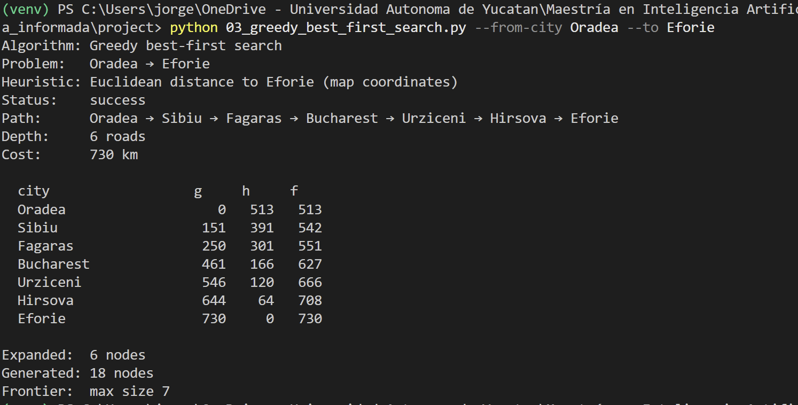
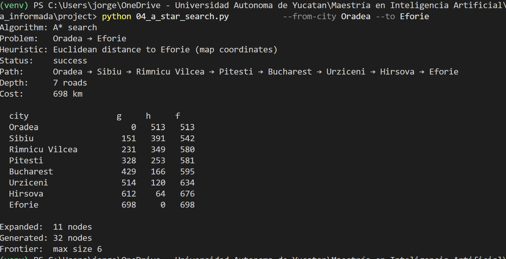

# Ejercicio 1 - Búsqueda no informada

## Pareja elegida

* **Origen**: Oradea
* **Destino**: Eforie



## Heurística h(n)

En este problema, el valor *h(n)* corresponde a la distancia euclidiana de la ciudad a nuestro destino (Eforie), calculamos el valor *h(n)* para las ciudades vecinas de nuestra ciudad origen (Oradea):

| Ciudad | *h(n)* |
| :--- | :--- |
| Zerind | 513 |
| Sibiu | 391 |

## Algoritmos de búsqueda informada (heurística)

Vamos a utilizar algoritmos de búsqueda informada para encontrar el mejor camino de Oradea a Eforie. En particular usaremos los algoritmos:
* Greedy
* A*


|Algorithm| Status | Path | Depth (roads) | Cost (km) | Expanded | Generated |
| :---| :--- | :--- | :--- | :--- | :--- | :--- |
| Greedy | success | Oradea → Sibiu → Fagaras → Bucharest → Urziceni → Hirsova → Eforie | 6 | 730 | 6 | 18 |
| A* | sucess | Oradea → Sibiu → Rimnicu Vilcea → Pitesti → Bucharest → Urziceni → Hirsova → Eforie | 7 | 698 | 11 | 32 |

### Subgrafo

```text
[Oradea] (h=513)
   │
   │ 151 km
   ▼
[Sibiu] (h=391)
   │
   ├──(99 km)──► [Fagaras] (h=301) ──(211 km)──┐  <-- Ruta Greedy
   │                                           │      (Sibiu -> Bucharest: 310 km)
   └──(80 km)──► [Rimnicu Vilcea] (h=349)      │
                      │                        │
                   (97 km)                     ▼
                      ▼                   [Bucharest] (h=166)
                 [Pitesti] (h=253)             │
                      │                        │ 85 km
                   (101 km)                    ▼
                      └──────────────────►[Urziceni] (h=120)
                                               │
                                            (98 km)
             <-- Ruta A*                       ▼
                 (Sibiu -> Bucharest:     [Hirsova] (h=64)
                  80+97+101 = 278 km)          │
                                            (86 km)
                                               ▼
                                          [Eforie] (h=0)
```

### Observaciones
* A* encontró el camino más óptimo (698km vs 730km). Greedy se desvió tomando la ruta de Sibiu a Fagaras.
* Greedy puede devolver un camino más caro porque sólo optimiza su siguiente movimiento y no considera el costo acumulado.
* En el algoritmo A* observamos que $f$ nunca disminuye, pues justamente el algoritmo optimiza $f$ en cada paso. Y dado que estamos usando la distancia euclidiana como nuestra heurística ésta es consistente por definición.


## Evidencias

### Heurística

### Greedy

### A*
