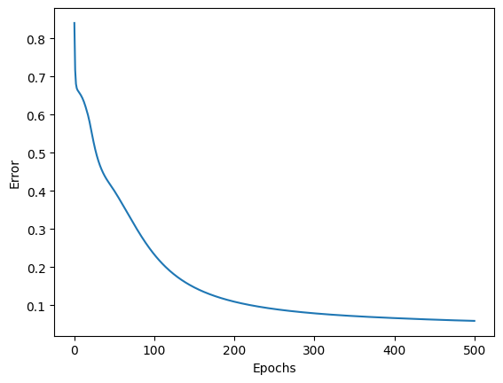
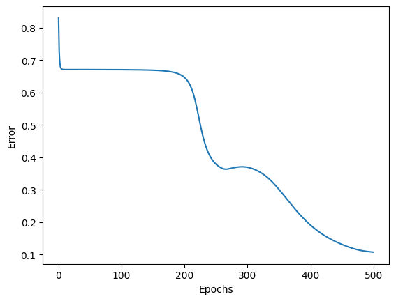
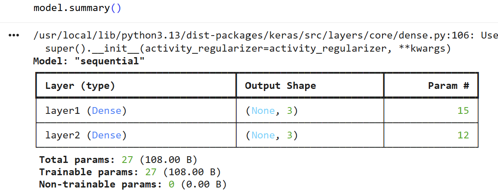
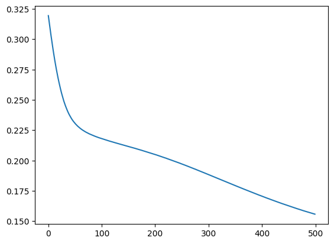
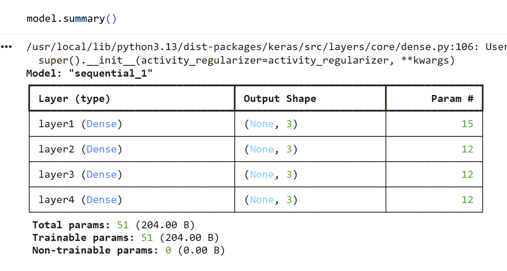
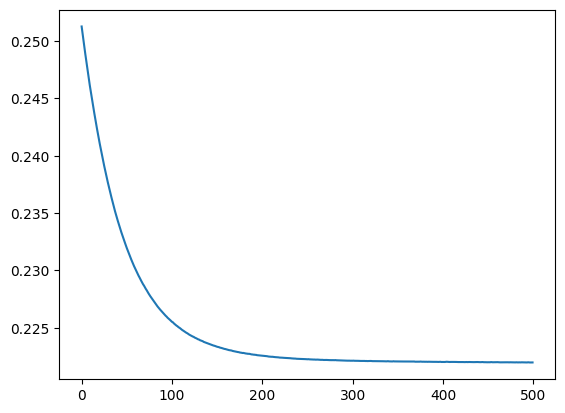
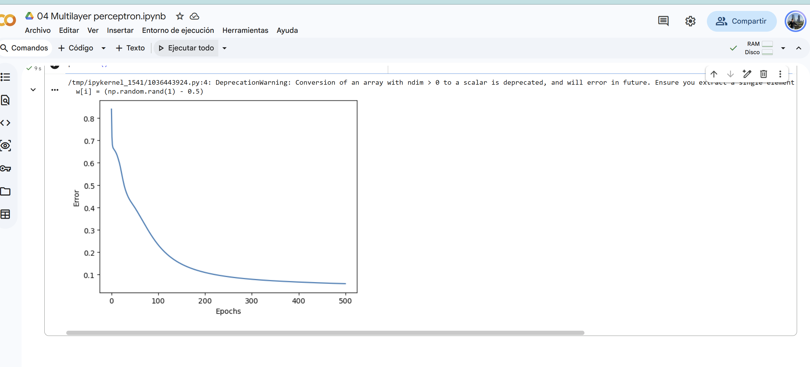
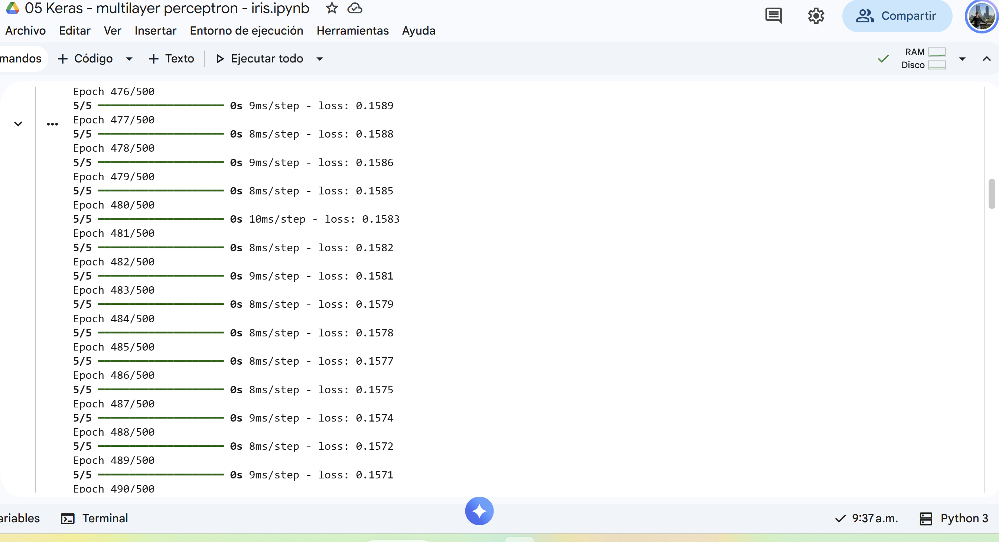

# Ejercicio 1 - Perceptrón multicapa

En este ejercicio vamos a comparar diferentes arquitecturas de redes neuronales para predecir el dataset *Iris*.

## Multilayer perceptrón a mano (Numpy)

### Red original

Primero se ejecutó el notebook con una arquitectura

$$ 4 \times 3 \times 3 $$

Se obtuvo la siguiente curva de pérdida

### Red más profunda

Posteriormente se ejecutó con una arquitectura:

$$ 4 \times 3 \times 3 \times 3 \times 3 $$

Se obtuvo la siguiente curva de pérdida

### Observaciones

Notamos que agregar más capas ocultas no disminuyó el error e incluso de 0 a 200 épocas se aplanó la curva de pérdida.

## Multilayer perceptrón (Keras)

### Red original

Primero se ejecutó el notebook con una arquitectura

$$ 4 \times 3 \times 3 $$

Se entrenó el modelo y se obtuvo el siguiente model summary y curva de pérdida:

### Red más profunda

Posteriormente se ejecutó con una arquitectura:

$$ 4 \times 3 \times 3 \times 3 \times 3 $$

Se entrenó el modelo y se obtuvo el siguiente model summary y curva de pérdida:

### Observaciones

Al igual que en el caso anterior, agregar más capas ocultas no disminuye el error. La profundidad adicional no necesariamente aporta una ventaja si la arquitectura y las funciones utilizadas dificultan la propagación del gradiente.

## Evidencias

