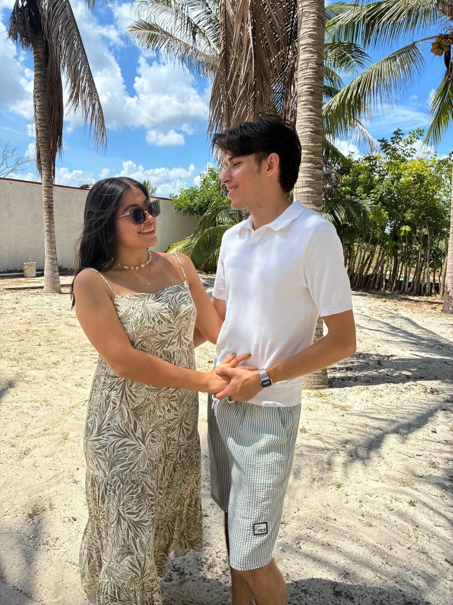
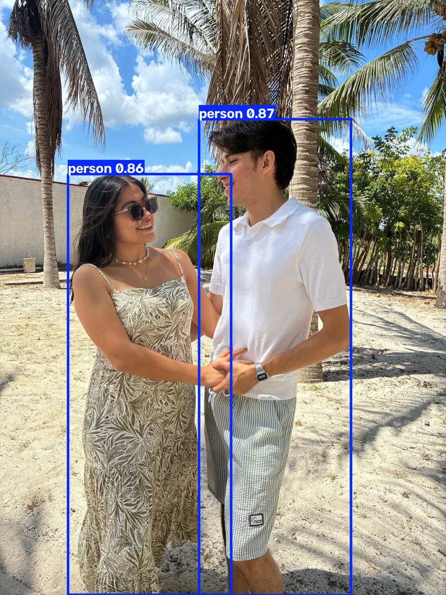
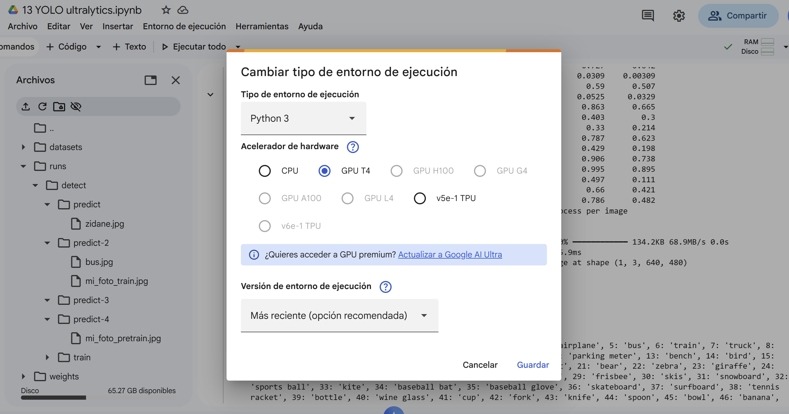

# Ejercicio 1 - Visión Computacional

### Procedimiento
Cargamos el notebook "*13 YOLO ultralytics.ipynb*" desde Google Colab. 
1. Primero se realizó inferencia en la imagen *zidane.jpg* desde la terminal con el modelo predeterminado
2. Posteriormente se entrenó el modelo y se realizó inferencia sobre *bus.jpg*

### Zidane (sin entrenamiento)

El modelo detectó las siguientes clases:
* 2 personas
* 1 corbata

### Bus (con entrenamiento)

El modelo detectó las siguientes clases:
* 4 personas
* 1 autobús
* 1 señal de alto

## Prueba con mi foto

Posteriormente subimos mi foto al entorno de trabajo:

Y realizamos la inferencia usando el modelo antes y después de entrenar.

### Mi foto (sin entrenamiento)

### Mi foto (con entrenamiento)

Notamos que el resultado de la detección fue practicamente el mismo, únicamente hubo una pequeña diferencia en los porcentajes asignados a la predicción.

Algunos elementos que pensé detectaría pero tal vez no forman parte de las clases del modelo son:

* Palmeras
* Lentes
* Reloj

## Evidencia ejecución

