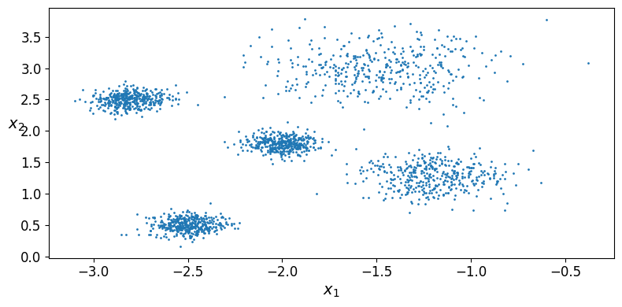
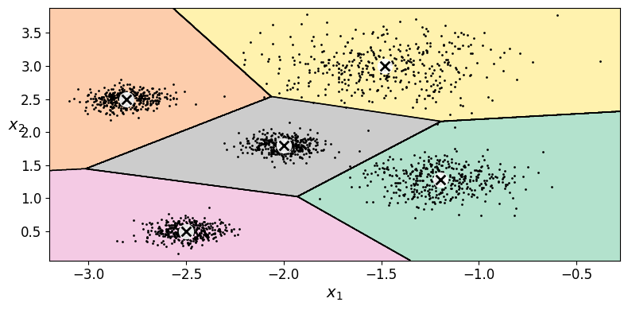
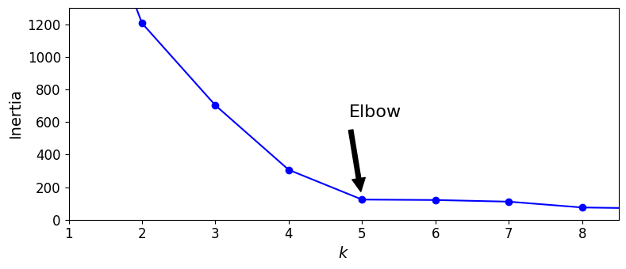
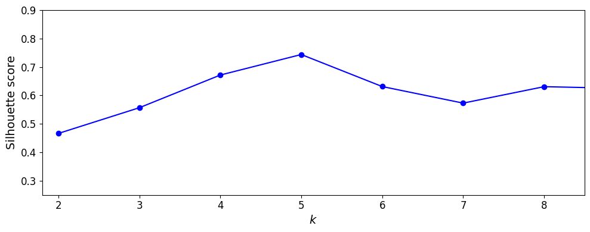
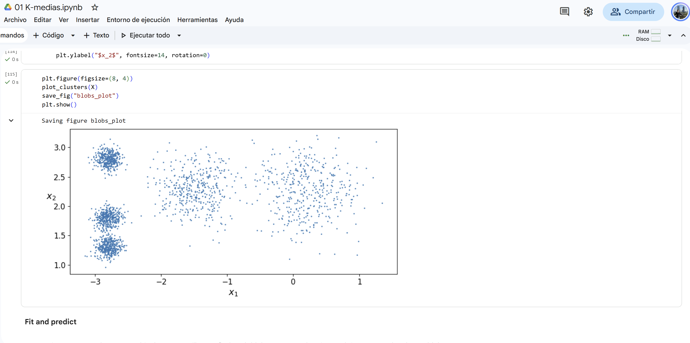
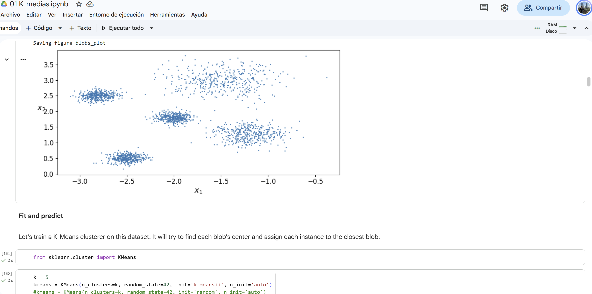

# Ejercicio 1 - Clustering k medias

## Clúster original

### Centros
```
blob_centers = np.array(
    [[ 0.2,  2.3],
     [-1.5 ,  2.3],
     [-2.8,  1.8],
     [-2.8,  2.8],
     [-2.8,  1.3]])
blob_std = np.array([0.4, 0.3, 0.1, 0.1, 0.1])
```

### Blobs


### Diagrama de Voronoi


### Curva de inercia


### Curva de silueta


## Clúster modificado

### Centros

```
blob_centers = np.array(
    [[ -1.2,  1.3],
     [-1.5 ,  3],
     [-2.8,  2.5],
     [-2,  1.8],
     [-2.5,  0.5]])
blob_std = np.array([0.2, 0.3, 0.1, 0.1, 0.1])
```

### Blobs


### Diagrama Voronoi



### Curva de inercia




### Curva de silueta




## Reporte

1. **En los datos de Géron, ¿por qué el codo prefiere ($k = 4$) si `make_blobs` usó 5 centros?**

   Porque la distancia entre los centros de los blobs de la izquierda es corta y el costo de añadir un centroide adicional no compensa el cambio en la inercia global.

2. **Con tus blobs separados, ¿el codo y la silueta coinciden en el mismo ($k$)? ¿Ese ($k$) es 5?**

   Sí, en mi caso la curva de inercia y la silueta sí coinciden y ambos son $k = 5$. Esto se debe a que separé los centros de los blobs, haciendo que el uso de un nuevo centroide para formar otro cluster sí reduzca la inercia de forma significativa.

3. **Si el codo sigue en 4, ¿qué te falta mover (distancia entre centros vs. `blob_std`)?**

   En mi caso sí está el codo en 5. Modifiqué la distancia entre los centros y ligeramente la desviación (`blob_std`) de un blob. Considero que la distancia entre los centros es lo que tiene mayor impacto en este ejemplo.

## Evidencias

### Ejecución original


### Ejecución modificada
