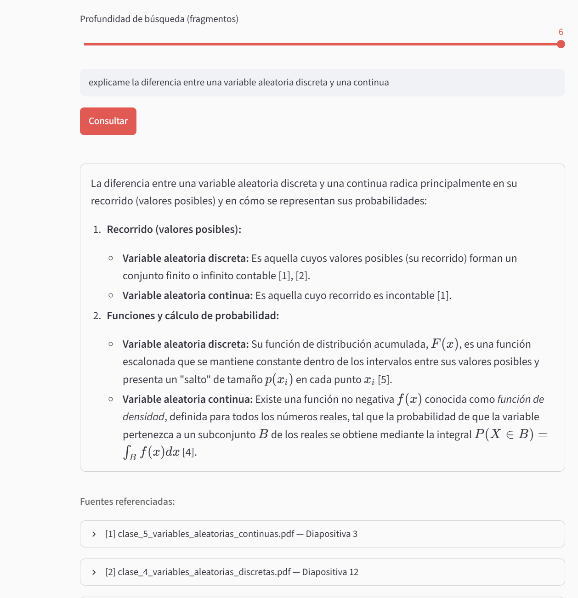
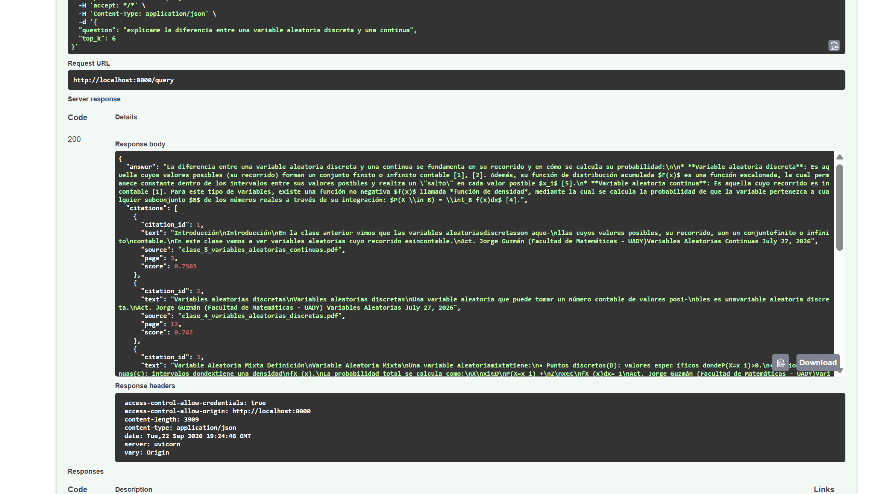
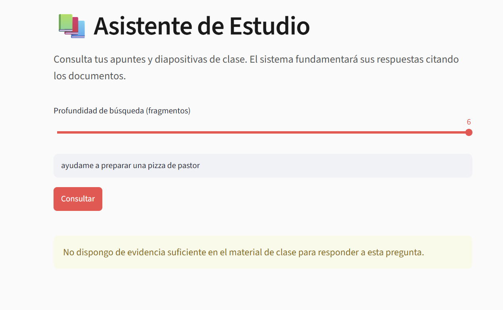

# Reporte Técnico: Sistema RAG para Material Docente

**Autor:** Jorge Miguel Guzmán Arjona

### 1. Dominio y tamaño del corpus
El corpus consiste en material docente universitario (diapositivas de clase). Está compuesto por 6 documentos PDF. Se utilizó el modelo `models/gemini-embedding-001` de Google AI para generar los vectores densos, resultando en un índice consolidado de 259 fragmentos (chunks).

### 2. Estrategia de partición (Chunking)
Dado que los documentos origen son presentaciones en LaTeX (Beamer), el principal reto fue la redundancia generada por las transiciones (`\pause`). 
Se implementó una partición a nivel de página con una heurística de deduplicación: si la página actual y la siguiente comparten más del 85% de sus palabras, se descarta la actual. Si una diapositiva final supera las 250 palabras, se divide con un solape (overlap) de 50 palabras para conservar el contexto.

### 3. Mecanismo de abstención
Para prevenir alucinaciones, el sistema aplica un filtro en dos niveles:
* **Recuperación:** Se evalúa la similitud coseno del fragmento más relevante (`top-1`). Si el score es menor a 0.60, se corta el flujo y se devuelve un estado de abstención.
* **Generación:** Si se supera el umbral, se envía la evidencia al LLM (`models/gemini-3.6-flash`) con temperatura 0.1 y una instrucción estricta que prohíbe usar conocimiento externo. Si los textos no contienen la respuesta, el modelo responde obligatoriamente: *"No dispongo de evidencia suficiente en el material de clase para responder a esta pregunta"*.

### 4. Roles de la arquitectura
* **FastAPI:** Orquesta las peticiones, procesa los PDFs y gestiona la lógica de recuperación.
* **Google AI (Gemini):** Actúa como motor de embeddings (vectorización) y como motor de generación (síntesis de respuesta anclada).
* **ChromaDB:** Base de datos vectorial persistente en disco local, encargada de almacenar vectores y metadatos, y calcular los k-vecinos más cercanos (k-NN).
* **Streamlit:** Interfaz gráfica para la ingesta de documentos y la interacción del usuario.

---

### Evidencias de Ejecución

**1. Interfaz de Streamlit con respuesta y citas válidas**

**2. Respuesta directa de FastAPI (Swagger UI)**

**3. Prueba de abstención (Pregunta fuera de dominio)**
